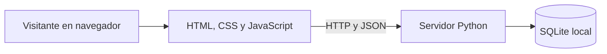

# Arquitectura del prototipo

## Vista general



Es una aplicación local de un solo proceso. El navegador carga archivos de `src/static/` y consume las rutas HTTP de `src/server.py`. El servidor valida solicitudes, consulta o modifica SQLite y devuelve JSON. No hay servicios externos, autenticación ni pasarela de pago.

## Componentes

| Componente | Responsabilidad | Ubicación |
| --- | --- | --- |
| Interfaz | Mostrar exposiciones y cupos; enviar formularios de reserva y cancelación. | `src/static/index.html`, `app.js`, `styles.css` |
| Servidor HTTP | Servir la interfaz y exponer las rutas de la API. | `src/server.py`, clase `Handler` |
| Reglas de reserva | Validar datos y evitar sobrecupos; cancelar reservas. | `create_reservation`, `cancel_reservation` |
| Persistencia | Crear esquema y guardar exposiciones, horarios y reservas. | SQLite mediante `sqlite3` |

La creación de reserva inicia una transacción `BEGIN IMMEDIATE`, comprueba el cupo y registra la reserva antes de confirmar. Esto evita que dos solicitudes simultáneas superen el cupo.

## Interfaces HTTP existentes

| Método y ruta | Función | Respuesta |
| --- | --- | --- |
| `GET /` | Interfaz web. | HTML |
| `GET /health` | Indicar si responde el servidor. | `{"status":"ok"}` |
| `GET /api/exhibitions` | Consultar exposiciones activas. | Lista JSON |
| `GET /api/slots` | Consultar horarios futuros y cupos. | Lista JSON |
| `POST /api/reservations` | Crear reserva. | `201` con código, horario y cantidad |
| `POST /api/reservations/cancel` | Cancelar reserva. | `200` con estado `cancelled` |

### Ejemplos de cuerpo JSON

Crear reserva:

```json
{"slot_id":1,"name":"Visitante Ejemplo","email":"ejemplo@example.test","party_size":2}
```

Cancelar reserva:

```json
{"code":"CODIGO_DEVUELTO","email":"ejemplo@example.test"}
```

El servidor responde con `400` cuando los datos no son válidos o el cupo es insuficiente. No se publica una especificación de API para funciones previstas.

## Dependencias y configuración

- Python 3.12 y su biblioteca estándar: `http.server`, `sqlite3`, `json`, entre otros.
- Navegador moderno con JavaScript.
- Variables `MAT_HOST`, `MAT_PORT`, `MAT_DB_PATH`; consulte [instalacion-configuracion.md](instalacion-configuracion.md).
- GitHub Actions para la verificación automática de sintaxis al publicar el repositorio.

## Límites técnicos actuales

El servidor `http.server` y la ausencia de autenticación lo restringen a uso local académico. Los datos son demostrativos. Antes de uso público se requieren controles de acceso, gestión de datos personales, despliegue adecuado y revisión de seguridad.

