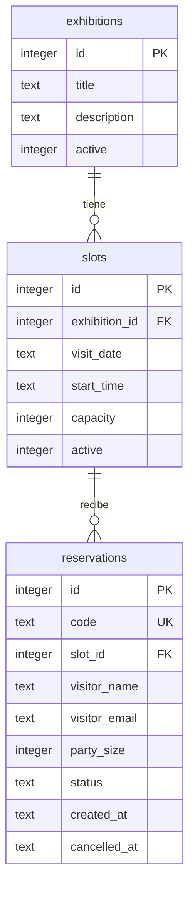

# Modelo de datos implementado

La aplicación guarda datos en SQLite, en `data/mat.sqlite3`. El archivo se crea al primer inicio y no forma parte del repositorio. El esquema real está en `initialize_database` de `src/server.py`.

## Tablas y reglas

| Tabla | Finalidad | Reglas principales |
| --- | --- | --- |
| `exhibitions` | Catálogo de exposiciones. | `active` vale 0 o 1. |
| `slots` | Fecha, hora y capacidad de una visita asociada a una exposición. | Capacidad positiva; combinación exposición-fecha-hora única. |
| `reservations` | Cupos reservados por una persona. | Código único; tamaño de grupo entre 1 y 4; estado `active` o `cancelled`. |

El cupo disponible se calcula como `slots.capacity` menos la suma de `party_size` de las reservas activas. Una cancelación cambia el estado, conserva el registro y libera el cupo. Las fechas de visitas se almacenan como texto ISO `AAAA-MM-DD`; la hora como `HH:MM`.

El primer inicio inserta dos exposiciones y tres horarios **de muestra** para facilitar la demostración. Estos registros no son información oficial del museo. El modelo todavía no incluye usuarios, compras, pagos, entradas, guías ni reportes porque dichas funciones no están implementadas.

